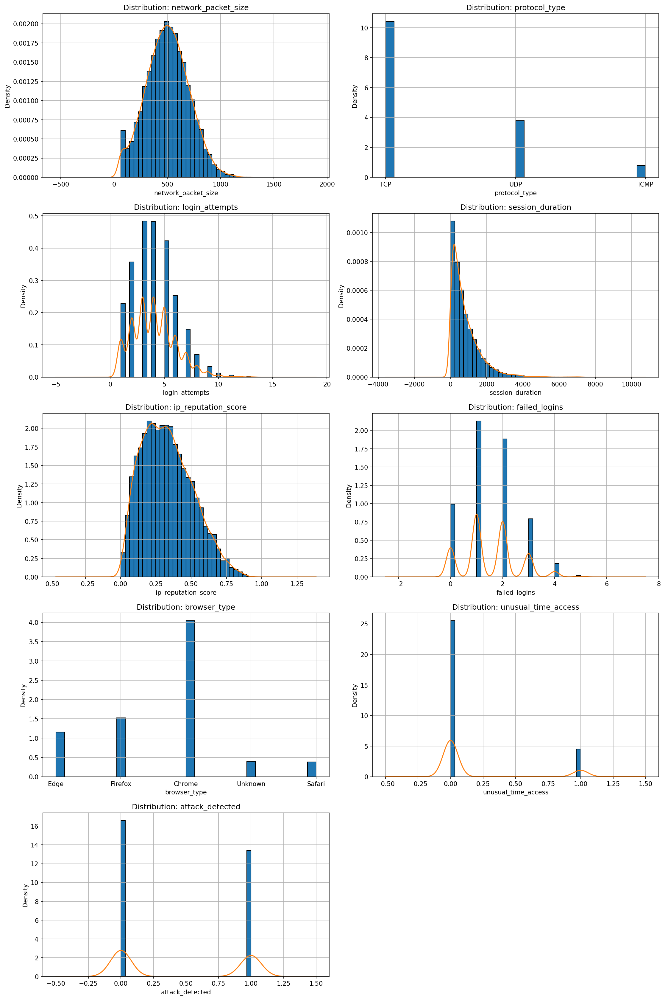

# Intrusion Log Analysis — Rule-based, Explainable Detection

**Goal:** show how simple, transparent rules can surface likely intrusions from raw logs, and evaluate those rules with clean metrics and visuals.

**Why it’s useful:** this is an explainable baseline for SOC triage—fast to run, easy to audit.

---

## 🔎 TL;DR (what I built)

- Wrote 8 transparent rules (R1–R8) from log fields (packet size tails, failed logins, unusual access time, etc.).
- Scored every rule (and selected pairs/triples) by **Precision**, **Recall**, **Lift**, and **Support**.
- Built a **priority order** using **incremental precision**—so the most reliable rules fire first.
- Generated an **alerts table** with human-readable reasons (e.g., `R5,R7`) and a simple **High / Low** severity policy.
- Shipped a **Streamlit app** with interactive tables and charts.

> From a sample run: baseline attack rate ≈ **0.447**. “High” alerts precision ≈ **0.85** vs baseline 0.45 (numbers vary with data).

---

## 🚀 Quickstart (pyproject)

### 1) Create a virtual env & install the package

```bash
python -m venv .venv
# macOS/Linux
source .venv/bin/activate

pip install -U pip
# editable install from pyproject (src/ layout)
pip install -e .
```

### 2) Reproduce the analysis

```bash
# Evaluate rules, compute metrics & priority
python notebooks/01_rules.py

# Build alerts with severity & reasons
python notebooks/02_alerts.py

# Save figures
python notebooks/03_visualization.py

```

### 3) Run the Streamlit app

```bash
streamlit run app.py
```

## Method

- Rules (R1–R8): simple boolean flags (e.g., failed_logins >= 4, ip_reputation_score >= 0.8, browser_type == "Unknown", “packet size in extreme tails”, etc.).
- Support (Hits): how many rows a rule matches.
- Precision: of the rows the rule flags, how many are true attacks.
- Recall: of all attacks, how many this rule catches.
- Baseline: overall attack rate in the dataset (e.g., 0.447).
- Lift: Precision / Baseline — Lift > 1 = better than guessing.
- Pairs/Triples: selected rule combinations (A ^ B, or A ^ B ^ C) with enough support.
- Incremental precision: when ordering rules, count only new hits/attacks at each step to see which rules add the cleanest signal.
- Rule of record: the first rule (by priority) that hits a row—used for severity and reasons.

### Results at a glance (example)

- Baseline attack rate: ~0.447
- Top precise singles: R5 (many failed logins) and R7 (high IP reputation), both ~1.00 precision in this run.
- Useful combinations: R4 ^ R6 (long session & unusual time) is very precise with manageable volume; R1 ^ R8 and R3 ^ R8 add breadth.
- Cumulative recall: with the chosen priority, recall grows to ~0.72 by step 10.
- Precision by severity: High ≈ 0.85, Low ≈ 0.41 (baseline ≈ 0.45).
- Values regenerate from your data; they will differ if the CSV changes.

### Figures

- Distributions

- Top rules by precision (dashed line = baseline)
![Top Precision]
- Top rules by lift

- Cumulative recall by priority

- Incremental precision per step

- Precision by severity (dashed = baseline)
![Precision by Severity]

### Streamlit app

- Overview: baseline, totals, interactive distribution plots & correlation heatmap.
- Rules & Metrics: sortable table of all rules/pairs/triples and their metrics.
- Incremental Coverage: “new attacks beyond earlier rules” + incremental precision.
- Alerts: first-hit rule_of_record, severity, and quick precision-by-severity check.
- Visuals: dynamic versions of the main charts.

### Key findings

- Authentication signals dominate: high failed-logins (R5) is the cleanest single flag.
- Reputation score adds surgical precision: R7 catches fewer rows but with very high precision.
- Time + duration matters: long sessions at unusual hours (R4 ^ R6) are high-quality alerts.
- “Unknown browser” is helpful but noisier: good coverage, lower precision; place later in the queue.
- Priority matters: front-loading high incremental precision gives better triage quality with fewer escalations.

### How to read the tables

- Rule metrics: each rule’s Hits, Attacks Detected, Precision, Recall, Lift.
- Top 25: most useful slice for quick review.
- Incremental coverage: per step, how many new attacks a rule adds beyond earlier ones.
- Incremental detail: shows new hits and incremental precision = (new attacks / new hits).
- Cumulative coverage: how total recall grows as you add rules in order.
- Alerts (priority): one “rule_of_record” per row with High/Low severity and reason codes.
- Precision by severity: quick QA—High should sit well above baseline.

### Glossary

- Precision: Of the rows flagged, what fraction are truly attacks.
- Recall: Of all attacks, what fraction we caught.
- Lift: Precision ÷ Baseline. > 1 is better than random.
- Support (Hits): How many rows a rule matched.
- Incremental: “New” coverage after excluding anything caught earlier.
